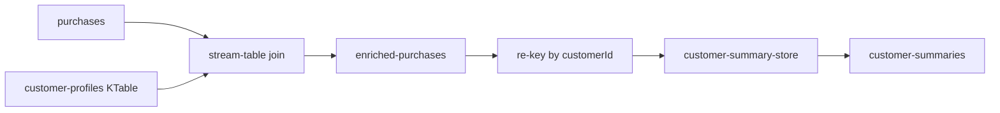

# #28 kafka-streams-demo

**Broker-backed smoke: 121.93 records/s median, 246.05 ms batch p95, output invariant 1.0.** This is 30-record dirty-tree development evidence; the clean five-sample release baseline is the only number eligible for the final portfolio post.

## 1. Overview

A Kotlin/Kafka Streams pipeline enriches purchase events with the latest customer profile and maintains a per-customer summary. The repository proves the same topology in two deliberately separate modes:

- deterministic `TopologyTestDriver` tests and microbenchmark;
- Kafka 4.3.1 end-to-end benchmark with three partitions and `exactly_once_v2`.

## 2. Problem

Streaming demos often test only a function or quote broker throughput from an in-memory driver. That does not prove producer-to-broker-to-topology behavior, committed output visibility, or state convergence. This repository measures those boundaries and fails the run unless output and aggregate invariants both hold.

## 3. Objectives

- Join `purchases` with the latest `customer-profiles` record by `customerId`.
- Emit one `enriched-purchases` record and one aggregate update per accepted input.
- Materialize named profile and summary stores.
- Keep domain contracts and policies independent from Kafka/framework code.
- Produce versioned JSON evidence with raw samples and provenance.
- Run locally with Docker and no credentials.

## 4. Architecture



The architecture is event-driven with minimal inward boundaries. `domain` owns data and policy; `infra` owns Kafka Serdes/topology/runtime; `benchmark` owns fixtures, orchestration, metrics, and evidence. Dependencies point inward to domain. Kafka remains visible at the application boundary because the topology and state model are the capability being proved.

See [docs/topology.md](docs/topology.md) and [sdd/architecture-decision.md](sdd/architecture-decision.md).

## 5. Stack

| Concern | Selection | Reason |
|---|---|---|
| Language/runtime | Kotlin 2.4.10, Java 21 | Immutable contracts, JVM interoperability, no unnecessary web runtime |
| Build | Gradle Wrapper 9.3.0, Kotlin DSL, dependency lock | Reproducible build and audited wrapper checksums |
| Streaming | Kafka Streams 4.3.1 | KTable join, keyed state, changelogs, exactly-once-v2 |
| Serialization | Kotlin serialization 1.11.0 | Small explicit JSON contracts |
| Testing | JUnit 5, AssertJ, TopologyTestDriver, Testcontainers 2.0.5 | Pure, topology, and broker-backed coverage |
| Runtime | Pinned Temurin JRE and Kafka Native images | Reproducible non-root Docker path |

Spring, REST, GraphQL, gRPC, a database, Kumo, and AWS are absent because no behavior in this problem needs them.

## 6. Structure

```text
src/main/kotlin/com/portfolio/streaming/
  domain/       events, state, and pure policies
  infra/        Serdes, topology, stores, Kafka properties
  benchmark/    fixtures, driver/broker harnesses, V2 evidence
src/test/       unit and topology tests
src/integrationTest/ broker-backed Testcontainers test
benchmarks/     evidence plan and release baseline
sdd/            specification, ADRs, benchmark and handoff
openspec/       tool-agnostic specification artifacts
tools/          validators, scans, benchmark and continuity scripts
```

## 7. Requirements

- Docker Desktop or another Docker Engine with Compose v2 for broker-backed execution.
- For host JVM execution: Java 21; Gradle is not installed globally because the repository wrapper is mandatory.
- PowerShell 7 (`pwsh`) or Windows PowerShell 5.1 for the release benchmark script.

No Kafka installation, cloud account, API key, or paid service is required.

## 8. Local execution

Linux/macOS:

```bash
./gradlew --no-daemon check
./gradlew --no-daemon run --args="demo"
./gradlew --no-daemon run --args="topology-benchmark 30 1 3 benchmarks/results/topology-smoke.json"
```

Windows uses `gradlew.bat` with the same arguments. The topology benchmark is broker-free and is not the public broker metric.

## 9. Docker execution

```bash
docker build -t kafka-streams-demo:local .
docker run --rm kafka-streams-demo:local demo
```

Real broker smoke:

```powershell
pwsh -File tools/run-broker-benchmark.ps1 `
  -Records 30 -Warmups 1 -Repeats 2 `
  -OutputPath benchmarks/results/broker-smoke.json -AllowDirty
```

The Compose runtime starts Kafka on `127.0.0.1:19092`, waits for broker health, runs the application with a read-only root filesystem, then removes broker data and the network.

## 10. Configuration

| Variable | Purpose | Default |
|---|---|---|
| `KAFKA_BOOTSTRAP_SERVERS` | Broker endpoint for `run`/broker benchmark | required by broker benchmark |
| `KAFKA_APPLICATION_ID` | Runtime application ID | `kafka-streams-demo-runtime` in Compose |
| `HARDWARE_CLASS` | Comparable environment label | `docker-desktop` |
| `SOURCE_COMMIT` | Full evidence source SHA | injected by benchmark script |
| `EVIDENCE_CLEAN_TREE` | Release provenance gate | computed by benchmark script |
| `EVIDENCE_IMAGE_DIGEST` | Application image digest | injected after build |
| `DEPENDENCY_LOCK_DIGEST` | Gradle lock digest | computed by benchmark script |

Evidence variables are provenance inputs, not user secrets.

## 11. Tests

```bash
./gradlew --no-daemon clean check
./gradlew --no-daemon integrationTest
```

Coverage targets behavior, not a cosmetic percentage: enrichment policy, join/aggregate semantics, missing profile behavior, evidence shape, broker output count, and aggregate-store delta. `integrationTest` requires Docker and uses a digest-pinned Kafka 4.3.1 image.

Repository gates:

```powershell
pwsh -File tools/validate-gradle-project.ps1 -SkipBuild
pwsh -File tools/validate-project.ps1 -SkipDocker
pwsh -File tools/scan-secrets.ps1
```

## 12. Benchmark

Release command:

```powershell
pwsh -File tools/run-broker-benchmark.ps1 `
  -Records 1000 -Warmups 1 -Repeats 5 `
  -OutputPath benchmarks/results/baseline.json

pwsh -File tools/validate-benchmark-result.ps1 `
  -Path benchmarks/results/baseline.json `
  -ExpectedBenchmarkId real-broker-end-to-end -RequireClean
```

Primary metric: `end_to_end_input_records_per_second`. Timing includes producing/flushing a batch, Kafka Streams processing, read-committed output consumption, and aggregate-store convergence. Every run records raw samples, workload/config digests, environment, source commit, clean-tree status, application image digest, dependency-lock digest, and comparability key.

Post benchmark: **"Exactly-once is not a checkbox: measuring Kotlin/Kafka Streams from producer input to committed output and materialized state."** The post compares correctness boundaries and latency distribution, not the topology-driver number against broker throughput.

## 13. Security

- Pinned JDK, JRE, Kafka, and Testcontainers image references.
- Audited Gradle wrapper distribution and JAR checksums.
- Locked Gradle dependency graph.
- UID/GID 10001, read-only root filesystem, dropped Linux capabilities, and `no-new-privileges`.
- `/tmp` is `noexec`; RocksDB JNI receives a smaller dedicated executable tmpfs.
- Broker host port binds only to loopback.
- CI uses minimal permissions, pinned action SHAs, secret/misconfiguration/dependency/image scans, and an SBOM artifact.

Exactly-once-v2 covers Kafka read-process-write behavior, not external side effects.

## 14. Observability

The benchmark JSON is the primary structured telemetry: throughput, batch latency, invariant ratio, failures, samples, duration, runtime, broker mode, partitions, and provenance. Kafka client warnings/errors remain available. There is no HTTP health endpoint because there is no HTTP service; Compose checks broker readiness and the benchmark waits for Kafka Streams `RUNNING` state.

## 15. Technical decisions

- Event-driven topology over MVC/MVVM: the problem is keyed asynchronous state, not request/view state.
- Kafka over RabbitMQ: KTable join, replay, changelog restoration, and stream state are required.
- Kotlin without Spring: no HTTP/DI/persistence lifecycle contributes to the claim.
- CLI/events over REST/GraphQL/gRPC: there is no client query contract.
- No cloud/Kumo: no cloud behavior exists; future provider behavior must enter behind an outbound port.

SOLID is applied where it creates a real boundary. LSP is not claimed for a nonexistent adapter hierarchy. KISS/YAGNI prevents decorative abstractions and infrastructure. Details are in [sdd/technical-decision.md](sdd/technical-decision.md).

## 16. Limitations

- One local KRaft broker with replication factor one does not prove availability or horizontal scale.
- JSON Serdes do not provide Schema Registry compatibility governance.
- The benchmark is Docker Desktop hardware-sensitive and only comparable under the same workload/comparability key.
- Remote interactive queries, multi-instance rebalances, authentication/TLS, DLQ ownership, and disaster recovery are production extensions.
- The opening number remains smoke evidence until the clean release baseline is generated.

## 17. Roadmap

1. Complete release-candidate scans, SBOM, clean baseline, and independent review.
2. Publish the branch and require green GitHub Actions before merge.
3. Add a multi-instance rebalance/restoration experiment only as a separate measured follow-up.
4. Generalize the broker benchmark harness into `portfolio-reuse-kit` after a second streaming consumer proves reuse.

## 18. References

See [REFERENCES.md](REFERENCES.md) for Kafka Streams, Gradle Wrapper, Kotlin, Testcontainers, Docker, OpenSpec, AITmpl, licenses, and reuse attribution.

## 19. License

MIT. See [LICENSE](LICENSE). Dependency and container contents retain their upstream licenses and are inventoried in the release SBOM.
