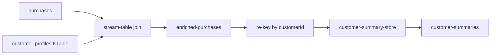

# Kafka Streams Enrichment and Aggregation: Broker-Backed, Exactly-Once Evidence in Kotlin

**Broker-backed baseline: 4,965.35 records/s median, 267.48 ms batch p95, output invariant 1.0.** Five measured iterations crossed a real Kafka 4.3.1 broker with `exactly_once_v2`; the evidence is bound to source, image, dependency lock, workload, and its own canonical SHA-256 digest.

[](https://github.com/Brilhante29/kafka-streams-demo/actions/workflows/ci.yml)
[](LICENSE)
 

## Why this exists

Streaming demos often test only a function or quote broker throughput from an in-memory driver. That does not prove producer-to-broker-to-topology behavior, committed output visibility, or state convergence. This repository measures those boundaries and fails the run unless output and aggregate invariants both hold.

A Kotlin/Kafka Streams pipeline enriches purchase events with the latest customer profile and maintains a per-customer summary, proved in two deliberately separate modes: deterministic `TopologyTestDriver` tests and microbenchmark, and a Kafka 4.3.1 end-to-end benchmark with three partitions and `exactly_once_v2`. It makes these properties verifiable:

- `purchases` join the latest `customer-profiles` record by `customerId`.
- Each accepted input emits one `enriched-purchases` record and one aggregate update.
- Named profile and summary stores are materialized.
- Domain contracts and policies stay independent from Kafka and framework code.
- Every run produces versioned JSON evidence with raw samples and provenance, locally with Docker and no credentials.

## Results

| Evidence | Result |
|---|---|
| Throughput samples (records/s) | 4,122.48; 3,738.61; 4,965.35; 5,237.01; 5,308.42 |
| Median throughput | **4,965.35 records/s** |
| Batch latency samples (ms) | 242.57; 267.48; 201.40; 190.95; 188.38 |
| Median / p95 batch latency | **201.40 / 267.48 ms** |
| Output invariant | **1.0 in all five iterations** |
| Image digest | `sha256:913190bf4f387cca93a09d66a3c7ca8969f9636223aad993462e39f21a6af61c` |
| Evidence digest | `sha256:e81a103aed906f48e91551b7f6099f148413d0a3ff12ff84bcc7eaa46200d4fd` |
| Comparability key | `kafka-streams-demo:real-broker-end-to-end:v1:jvm21` |

Primary metric: `end_to_end_input_records_per_second`. Timing includes producing and flushing a batch, Kafka Streams processing, read-committed output consumption, and aggregate-store convergence. Every run records raw samples, workload and config digests, environment, source commit, clean-tree status, application image digest, dependency-lock digest, comparability key, and a canonical artifact digest.

**How to read it:** the throughput population CV is 13.47% and the max/min ratio is 1.42 on this short local run, so the raw samples are part of the claim; the median alone is not presented as a capacity SLA. The correctness signal is the output invariant of 1.0 in every iteration. The broker-free topology benchmark is a separate number and is never compared with broker throughput.

## Quickstart

```bash
docker build -t kafka-streams-demo:local .
docker run --rm kafka-streams-demo:local demo
```

Docker Engine with Compose v2 is the only requirement for the default path. No Kafka installation, cloud account, API key, or paid service is needed.

## How it works


```mermaid
flowchart LR
    P["purchases"] --> J["stream-table join"]
    CP["customer-profiles KTable"] --> J
    J --> E["enriched-purchases"]
    E --> K["re-key by customerId"]
    K --> S["customer-summary-store"]
    S --> O["customer-summaries"]
```

The architecture is event-driven with minimal inward boundaries. `domain` owns data and policy; `infra` owns Kafka Serdes, topology, and runtime; `benchmark` owns fixtures, orchestration, metrics, and evidence. Dependencies point inward to domain. Kafka remains visible at the application boundary because the topology and state model are the capability being proved. See [docs/topology.md](docs/topology.md) and [sdd/architecture-decision.md](sdd/architecture-decision.md).

The Compose runtime starts Kafka on `127.0.0.1:19092`, waits for broker health, runs the application with a read-only root filesystem, then removes broker data and the network. The benchmark JSON is the primary structured telemetry: throughput, batch latency, invariant ratio, failures, samples, duration, runtime, broker mode, partitions, and provenance. There is no HTTP health endpoint because there is no HTTP service; the benchmark waits for the Kafka Streams `RUNNING` state.

### Stack

| Concern | Selection | Reason |
|---|---|---|
| Language/runtime | Kotlin 2.4.10, Java 21 | Immutable contracts, JVM interoperability, no unnecessary web runtime |
| Build | Gradle Wrapper 9.3.0, Kotlin DSL, dependency lock | Reproducible build and audited wrapper checksums |
| Streaming | Kafka Streams 4.3.1 | KTable join, keyed state, changelogs, exactly-once-v2 |
| Serialization | Kotlin serialization 1.11.0 | Small explicit JSON contracts |
| Testing | JUnit 5, AssertJ, TopologyTestDriver, Testcontainers 2.0.5 | Pure, topology, and broker-backed coverage |
| Runtime | Pinned Temurin JRE and Kafka Native images | Reproducible non-root Docker path |

### Configuration

| Variable | Purpose | Default |
|---|---|---|
| `KAFKA_BOOTSTRAP_SERVERS` | Broker endpoint for `run` and the broker benchmark | required by broker benchmark |
| `KAFKA_APPLICATION_ID` | Runtime application ID | `kafka-streams-demo-runtime` in Compose |
| `HARDWARE_CLASS` | Comparable environment label | `docker-desktop` |
| `SOURCE_COMMIT` | Full evidence source SHA | injected by benchmark script |
| `EVIDENCE_CLEAN_TREE` | Release provenance gate | computed by benchmark script |
| `EVIDENCE_IMAGE_DIGEST` | Application image digest | injected after build |
| `DEPENDENCY_LOCK_DIGEST` | Gradle lock digest | computed by benchmark script |

Evidence variables are provenance inputs, not user secrets.

## Design decisions

| Decision | Why | Rejected |
|---|---|---|
| Event-driven topology | The problem is keyed asynchronous state, not request or view state | MVC or MVVM |
| Kafka Streams | KTable join, replay, changelog restoration, and stream state are required | RabbitMQ |
| Kotlin without Spring | No HTTP, dependency-injection, or persistence lifecycle contributes to the claim | Spring Boot |
| CLI and events as the interface | There is no client query contract | REST, GraphQL, or gRPC |
| No cloud emulation | No cloud behavior exists; future provider behavior must enter behind an outbound port | Kumo or AWS SDKs |

SOLID is applied where it creates a real boundary. LSP is not claimed for a nonexistent adapter hierarchy. KISS and YAGNI prevent decorative abstractions and infrastructure. Details are in [sdd/technical-decision.md](sdd/technical-decision.md).

### Security

- Pinned JDK, JRE, Kafka, and Testcontainers image references.
- Audited Gradle wrapper distribution and JAR checksums, and a locked Gradle dependency graph.
- UID/GID 10001, read-only root filesystem, dropped Linux capabilities, and `no-new-privileges`.
- `/tmp` is `noexec`; RocksDB JNI receives a smaller dedicated executable tmpfs.
- The broker host port binds only to loopback.
- CI uses minimal permissions, pinned action SHAs, secret, misconfiguration, dependency, and image scans, and an SBOM artifact.
- Local Trivy 0.69.3 filesystem and image scans completed with zero HIGH/CRITICAL findings and no `ignore-unfixed` or other suppression.
- The retained SPDX 2.3 SBOM inventories 158 packages; 25 `NOASSERTION` license records are explicitly tracked for upstream review.

Exactly-once-v2 covers Kafka read-process-write behavior, not external side effects.

## Testing

```bash
./gradlew --no-daemon clean check
./gradlew --no-daemon integrationTest
./gradlew --no-daemon run --args="demo"
```

Windows uses `gradlew.bat` with the same arguments; host execution needs Java 21, and the repository wrapper replaces a global Gradle install. Coverage targets behavior, not a cosmetic percentage: enrichment policy, join and aggregate semantics, missing profile behavior, evidence shape, broker output count, and aggregate-store delta. `integrationTest` requires Docker and uses a digest-pinned Kafka 4.3.1 image.

Repository gates:

```bash
pwsh -File tools/validate-gradle-project.ps1 -SkipBuild
pwsh -File tools/validate-project.ps1 -SkipDocker
pwsh -File tools/scan-secrets.ps1
```

## Limitations

- One local KRaft broker with replication factor one does not prove availability or horizontal scale.
- JSON Serdes do not provide Schema Registry compatibility governance.
- The five-sample run has 13.47% throughput CV; one warmup and local Docker Desktop scheduling limit statistical confidence.
- Exactly-once-v2 was proved for normal broker-backed execution, not crash, restart, or retry recovery, or external side effects.
- Remote interactive queries, multi-instance rebalances, authentication and TLS, DLQ ownership, and disaster recovery are production extensions.

### Next steps

1. Separate the topology microbenchmark CLI dependency from the minimal runtime image.
2. Add crash, restart, retry, and multi-instance rebalance and restoration experiments as measured follow-ups.
3. Restrict the results bind mount to the benchmark-specific Compose service.
4. Generalize canonical evidence validation and the broker harness in `portfolio-reuse-kit` after a second consumer proves reuse.

## Reproducibility

The release benchmark needs PowerShell 7 (`pwsh`) or Windows PowerShell 5.1, plus Python 3 for the cross-language canonical evidence-digest validator:

```bash
pwsh -File tools/run-broker-benchmark.ps1 -Records 1000 -Warmups 1 -Repeats 5 -OutputPath benchmarks/results/baseline.json
pwsh -File tools/validate-benchmark-result.ps1 -Path benchmarks/results/baseline.json -ExpectedBenchmarkId real-broker-end-to-end -RequireClean
```

The broker-free topology benchmark runs with `./gradlew --no-daemon run --args="topology-benchmark 30 1 3 benchmarks/results/topology-smoke.json"`; it is not the public broker metric.

## Project structure

```text
src/main/kotlin/com/portfolio/streaming/
  domain/       events, state, and pure policies
  infra/        Serdes, topology, stores, Kafka properties
  benchmark/    fixtures, driver/broker harnesses, V2 evidence
src/test/       unit and topology tests
src/integrationTest/ broker-backed Testcontainers test
benchmarks/     evidence plan and release baseline
sdd/            specification, ADRs, benchmark and handoff
openspec/       tool-agnostic specification artifacts
tools/          validators, scans, benchmark and continuity scripts
```

## How this repository is built

The project follows the spec-driven workflow of [portfolio-reuse-kit](https://github.com/Brilhante29/portfolio-reuse-kit). Requirements and decisions live in [`sdd/`](sdd) and [`openspec/`](openspec), and [`project.yaml`](project.yaml) records the architecture, stack, and rejected alternatives. Development is AI-assisted and human-governed: [`AGENTS.md`](AGENTS.md) and [`CLAUDE.md`](CLAUDE.md) hold the coding-agent instructions, while tests, validators, and CI decide what gets published.

## Related work

- [outbox-pattern](https://github.com/Brilhante29/outbox-pattern): reliable publication to a Kafka-compatible broker.
- [event-sourcing-orders](https://github.com/Brilhante29/event-sourcing-orders): append-only events with rebuildable projections.

See [REFERENCES.md](REFERENCES.md) for Kafka Streams, Gradle Wrapper, Kotlin, Testcontainers, Docker, OpenSpec, AITmpl, licenses, and reuse attribution.

## Author

**Guilherme Brilhante**, software engineer working on scalable backends and production AI.
[LinkedIn](https://www.linkedin.com/in/guilhermefreirebrilhanteseveriano/) · [GitHub](https://github.com/Brilhante29) · [Publications](https://dblp.org/pid/353/6812.html)

## License

[MIT](LICENSE). Dependency and container contents retain their upstream licenses and are inventoried in the release SBOM.
