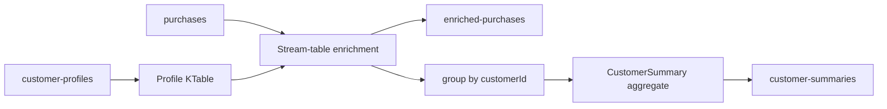

# Kafka Streams Enrichment and Aggregation: Stream-Table Join in Kotlin

**A Kafka Streams topology in Kotlin joins purchases with the latest customer profile, publishes enriched events, and keeps a running per-customer aggregate**, tested deterministically without a broker. Harness benchmark: `17.92 messages/s` (p95 `76.64 ms` per record over 100,000 events). That number measures one RocksDB flush per record in `TopologyTestDriver`, not Kafka Streams throughput ([diagnosis](docs/benchmark-diagnosis.md)).

[](https://github.com/Brilhante29/kafka-streams-demo/actions/workflows/ci.yml)
[](LICENSE)
 

## Why this exists

Stream processing code is often only ever tested against a live cluster, which makes tests slow, flaky, and dependent on infrastructure setup. The topology logic, which is the part that carries business meaning, gets the least scrutiny. This repository keeps the topology small, pure where possible, and testable in milliseconds:

- business rules live in a domain layer with no Kafka dependency;
- the topology is built once by `TopologyFactory` and exercised through `TopologyTestDriver`, so tests need no broker, network, or secret;
- the real-broker path (`run`) uses the same topology with production settings, and Redpanda is available through `docker-compose.real.yml`.

## What it does


```mermaid
flowchart LR
    P[customer-profiles] --> T[Profile KTable]
    E[purchases] --> J[Stream-table enrichment]
    T --> J
    J --> X[enriched-purchases]
    J --> G[group by customerId]
    G --> A[CustomerSummary aggregate]
    A --> S[customer-summaries]
```

`customer-profiles` is a compacted table in a real deployment. Each purchase is joined with the latest profile, published to `enriched-purchases`, and reduced into a running summary per `customerId` in the `customer-summary-store` state store. Purchases for unknown profiles produce no output (inner join), and a test pins that behavior.

## Results

| Measure | Value |
|---|---:|
| Harness throughput (`messages_per_second`) | 17.92 messages/s |
| Per-record latency, average / p95 / p99 | 55.81 / 76.64 / 105.96 ms |
| Records | 100,000 (seed `42`) |
| Enriched and summary outputs | 100,000 / 100,000 |
| Mode | `TopologyTestDriver`, no broker |

How to read it: `TopologyTestDriver` commits after every record, and each commit flushes the RocksDB stores behind the profile table and the aggregate. A controlled diagnostic on one host measured a median `158.62 messages/s` with the published RocksDB stores versus `4621.16 messages/s` with in-memory stores, everything else equal ([raw runs](benchmarks/diagnostics/), [write-up](docs/benchmark-diagnosis.md)). The topology keeps RocksDB because persistent state is the right production default; a broker-backed benchmark is the honest way to report throughput and is the open item.

## Quickstart

With Java 21 and Gradle 8.10+:

```bash
gradle test
gradle run --args="demo"
gradle run --args="benchmark 1000 benchmarks/results/latest.json"
```

With Docker:

```bash
docker build -t kafka-streams-demo .
docker run --rm kafka-streams-demo demo
docker run --rm -v "${PWD}/benchmarks/results:/app/benchmarks/results" kafka-streams-demo benchmark 1000 /app/benchmarks/results/latest.json
```

The image build runs `clean check installDist`. The demo and benchmark need no Kafka, Redpanda, secret, or paid account.

Against a real broker:

```bash
docker compose -f docker-compose.real.yml up --build
```

Or run the application with `run` and set `KAFKA_BOOTSTRAP_SERVERS` (and optionally `KAFKA_APPLICATION_ID`). Topics, TLS/SASL, and production observability belong to the deployment configuration.

## Design decisions

| Decision | Why | Rejected |
|---|---|---|
| Kafka Streams DSL with a `KTable` join | Latest-profile enrichment is exactly a stream-table join | Consumer loop with a hand-rolled cache |
| Deterministic test-driver settings, separate runtime settings | Tests see every update in order; the broker path keeps Kafka Streams defaults for commits and caching | One property set for both (committing every record in production) |
| Domain without Kafka imports | Business rules are testable as plain functions | Logic embedded in lambdas inside the topology |
| Redpanda only as an optional runtime adapter | Kafka API compatible, single container for local runs | A broker in the default test path |
| No database, cloud, or outbox | The topology does not need them | Infrastructure for its own sake |

## Testing

```bash
gradle clean check
```

Tests cover the pure enrichment policy, the profile join, the incremental aggregate, the unknown-profile case, and both property profiles; `check` also runs ktlint. CI repeats tests, lint, the benchmark JSON check, and `docker build`.

## Limitations

- The benchmark is a harness measurement (see above), not broker throughput.
- No schema registry; events use JSON serdes from `kotlinx.serialization`.
- No exactly-once configuration, windowing, or late-event handling yet.

## Project structure

```text
src/main/kotlin/com/portfolio/streaming/
  domain/       events and pure business policy
  infra/        serdes, topology, Kafka configuration
  benchmark/    fixed fixture and JSON report
src/test/kotlin/com/portfolio/streaming/   domain, topology, and configuration tests
benchmarks/    committed baseline and diagnostic runs
docs/          topology notes and benchmark diagnosis
sdd/  openspec/  specification, architecture and technical decisions
```

## How this repository is built

The project follows the spec-driven workflow of [portfolio-reuse-kit](https://github.com/Brilhante29/portfolio-reuse-kit). Requirements and decisions live in [`sdd/`](sdd) and [`openspec/`](openspec), and [`project.yaml`](project.yaml) records the architecture, stack, and rejected alternatives. Development is AI-assisted and human-governed: [`AGENTS.md`](AGENTS.md) and [`CLAUDE.md`](CLAUDE.md) hold the coding-agent instructions, while tests, validators, and CI decide what gets published.

## Related work

- [outbox-pattern](https://github.com/Brilhante29/outbox-pattern): reliable publication to a Kafka-compatible broker from a transactional database.
- [event-sourcing-orders](https://github.com/Brilhante29/event-sourcing-orders): append-only events and rebuildable projections.

See [`REFERENCES.md`](REFERENCES.md), the [specification](sdd/spec.md), and the [architecture decision](sdd/architecture-decision.md).

## Author

**Guilherme Brilhante**, software engineer working on scalable backends and production AI.
[LinkedIn](https://www.linkedin.com/in/guilhermefreirebrilhanteseveriano/) · [GitHub](https://github.com/Brilhante29) · [Publications](https://dblp.org/pid/353/6812.html)

## License

[MIT](LICENSE).
