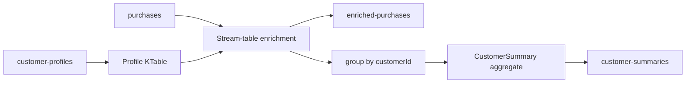

# Topology

`customer-profiles` is a compacted-table input in a real Kafka deployment. The
purchase stream is joined with the latest profile, then the enriched record is
both published and reduced into a per-customer running summary.

The default `demo` and `benchmark` commands build the same topology through
`TopologyTestDriver`. They do not start `KafkaStreams` or open a broker
connection. The `run` command is the explicit production adapter path and
reads `KAFKA_BOOTSTRAP_SERVERS`.
